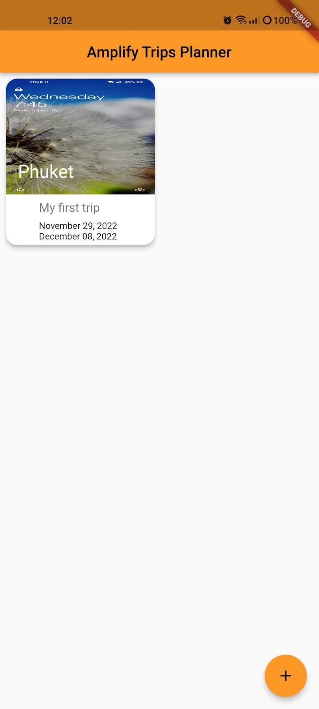
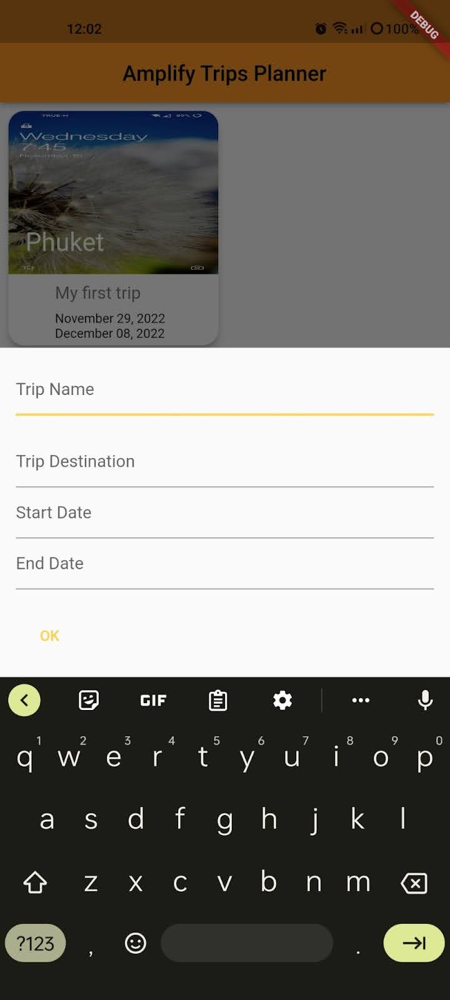

# Introduction

## MyTrip is a trip planning application created using Flutter and AWS Amplify. Users will

## be able to plan their trip using this application. It basically is a to-do application, but for

## all your trips. Users can set names and destinations, choose the date for the trip, and

## add images to the trip. One of the major problems that this application solves is that,

## due to lack of proper planning, people sometimes forget to visit many important places

## which they had in mind. While going to a new city or country, users can make a list of

## things they wanna do or places they can’t miss visiting. Someone who is going to

## pattaya for vacation can add all the places to visit there, within the application. Users

## can basically create their itinerary within the application. It will help users to focus more

## on the trip than on thinking of the next place to go.

## This application can be of great help for someone who loves traveling and want to plan

## their trips before-hand.

# Literature review

Since many people are into traveling and prefer planning their trips earlier, there are few
applications that provide trip planning facilities.Some of them are large scale applications with
different paid features. Some of them are listed below:
**Wanderlog** :
Wanderlog is a planning app for any trip that people might have in mind. It provides a list of
places so that users can just add them to their plan. Users can share the trip plan with different
people and also add friends to the plan. It also provides flight and hotel reservation features.
Users can also attach all their necessary documents like hotel reservation, flight tickets, etc to
the application so that the users don't need to go search their emails and other locations.
**Trackena** :
Trackena provides users with different tools that can be integrated within the user’s planning.
Users can create projects and add planners to that. Users are provided with features to add
expense items which can help them to keep track of expenses too. Having features like
collaboration, users can invite multiple people to trip planning. It also has a poll feature where
users in a planner can poll for their next trip.
**Tripsy** :
Tripsy is a travel planner that enables you to share your schedule with family and friends,
receive flight alerts, save documents, and even offers suggested routes to some places
worldwide. All the trips can be categorized for future reference. It provides suggestion features
to the users where the application suggests attraction, events, places to visit etc. The app
provides some level of customization where users can set app background and theme based on
their preference. Users can also create their travel journal based on the images, videos, and
any other files regarding a particular trip and share that with friends and family. Although most of
the features are free, user’s need to subscribe for premium applications to access a few
features.
These are some of the applications that are available for users to use that provide trip planning
features along with few more.

# Objectives

The main objective of MyTrip is a trip planner application that can help people better plan their
next trip. It can help people focus more on their trip instead of searching for places to visit. It can
work as a travel journal for future reference. People due to various reasons tend to forget every
detail they’ve planned for the trip, once they visit the actual place, this application helps them to
plan all that during the time of planning and make a proper itinerary. This can later help in saving
time and users can also visit all the places they planned.

# Architecture

The system consists of mobile applications and various AWS services. Mobile applications work
as a front-end where the user can interact with the system. AWS S3 will be used to store the
images that users upload during their trip planning. AWS Amplify works as the cloud backend
for the application. It will also provide the authentication service for our system. Amazon Cognito
helps in identity and access management.

## GraphQL API will be added to the application that will help in retrieving the trip data. It

## uses AWS Appsync which is a GraphQL management service, backed by the Amazon

## DynamoDB database. An on-device storage engine called Amplify datasync will be

## used which will help in synchronizing data between the user’s phone and AWS cloud

## database. It helps in making the app real time as well as offline.

# How the project works

The system is a cross-platform mobile application created using Flutter. The mobile application
lets users create plans for their trips and view everything they posted. First of all, users are
asked to register and they can login with the credentials they added. The authentication is
handled by the amplify authentication handler. Once the user logs in with correct credentials,
they are sent to the home screen. In the home screen, users can create a new task with all the
necessary data like images, trip start data, trip end data. Edit and delete features are available
for the users in the home screen.
The mobile application interacts with amplify to handle the authentication and to connect to the
database server. Amplify helps in providing the data using GraphQL API, which will send the
request and provide response to the mobile app. AUthentication is handled using AWS cognito.
It helps in secure login and to store the login credentials offline so that manual process for
storing user’s session in a mobile app is not needed.

# Describe if your project follows the well architect

# framework

The project implements different AWS technologies in order to follow a well architect framework.
The principle of well architected framework includes:
**Operational excellence** : Use of AWS AMPLIFY the system ensuring the operational excellence
in the system. It provides functionalities like data storage, authentication, analytics and many
more using AWS services for the backend functionality. It can be used in businesses to improve
speed and agility. Amplify can help in reducing the number of code as it handles most of the
services automatically. There is no need to create a backend from scratch.
**Security** : The use of AWS cognito helps to maintain security within the system. It is an AWS
product that controls user auth and access for mobile applications on internet-connected
devices. It can be used to add Multi factor authentication to the user app so that users don't
reply only or username/password. It also uses JWT tokens that can be used to return responses
in a secure way and to manage the user's session.
**Reliability** : AWS Amplify can provide reliable mobile applications that can overcome issues in
the network. It can provide real-time services related to the data, so the activity that the user
performs is reflected instantly. It can also maintain the offline state of data, it will make sure that
the user is able to view the data even though there is network disruption. Use of AWS S3 to
store the user images is beneficial as S3 has a 99.99999999999 durability rate.
**Performance efficiency** : The use of GraphQL API for data fetching and requesting, the
performance of the system is increased. Unlike normal API, the GraphQL allows the users to
specify the actual data they need for the operation, so it only provides the limited data instead of
bombarding the users with all the available data. It will highly affect the performance of the
application. Dynamo db is used as the database, which provides up to 40,000 WCUs. Being a
NoSQL database, It’s performance is better than other databases.
**Cost optimization** : Since most of the services that are being used are in pay-per-use models,
the cost of the service can be minimized. Cost of requests can be reduced using GraphQl, as it
only sends the data that the user asked for. One of the major data that takes more space are
the images in the application. The cost of them can be reduced using S3. It takes around $0.
per GB of data for the first 50 GB data. It is cheap compared to other services that provide
similar functionality.
**Sustainability:** As the top cloud provider, AWS is also energy-efficient. Its energy efficiency is
3.6 times more than the median of studied enterprise data centers in the United States and up
to five times greater than typical enterprise infrastructure in the European Union. By 2025, AWS
plans to run its operations entirely on renewable energy.

